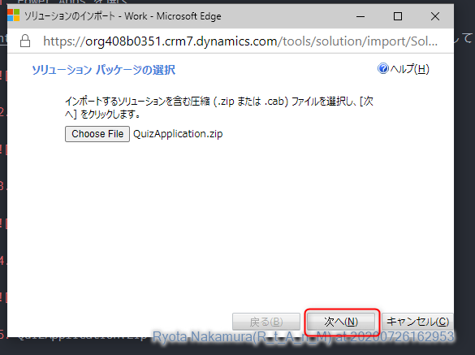

# インポート手順

## 1. Power Apps 

1. Power Apps を開く

https://make.powerapps.com/ にアクセスし、インポート先の環境を指定しておく。


2. ソリューションを開く


3. インポートをクリックする


4. 別ウィンドウが立ち上がるので、「chooce file」をクリックする


5. QuizApplication.Zip を選択する


6. 次へをクリックする



7. 引き続き次へをクリックする


※アンインストールができない旨の警告が出ているが、これはインポート先でも変更可能としているため表示されている。アンインストールはできないが、個別で削除することは可能。

8. インポートをクリックする


9. インポートが完了するまで待つ


10. インポートが完了したら、「すべてのカスタマイズの公開」をクリックする。


11. 公開が完了したら閉じるをクリックする。

12. Power Apps アプリに以下の2つが追加されていることを確認する。


# 2. Logic Apps

## 2-1. 前提条件

* Azure アカウントを持っていること
* インポート先のリソースグループを作成していること
* Azure Az モジュールがインストール済みであること

## 2-2. インポート

1. Power Shellを起動する

2. 以下のコマンドを実行する

```
Connect-AzAccount
Get-AzSubscription
Select-AzureRmSubscription -Subscription <インポート先のリソースグループが含まれるサブスクリプション名>
New-AzResourceGroupDeployment -ResourceGroupName <インポート先のリソースグループ名> -TemplateFile  <template.json のフルパス>
```

以降は作成途中
